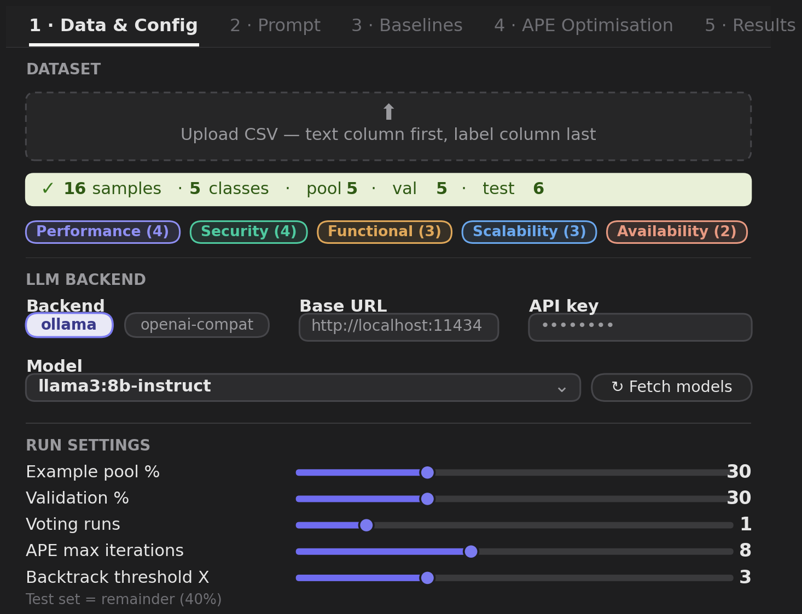
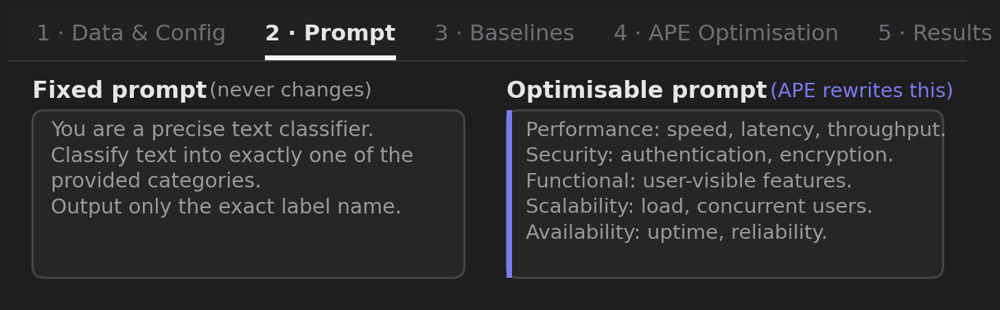
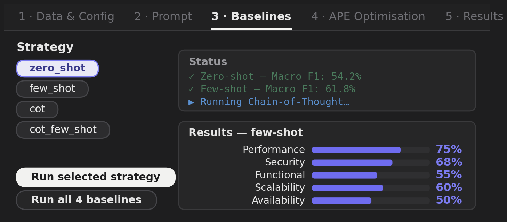
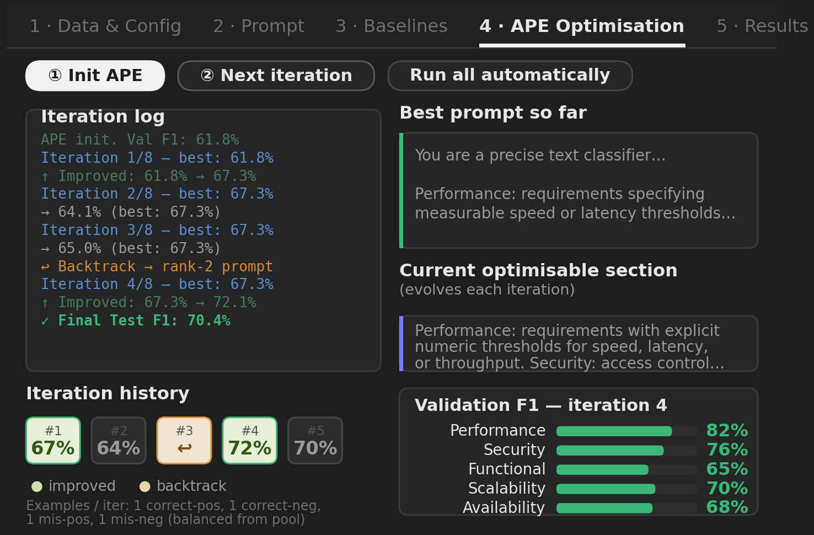
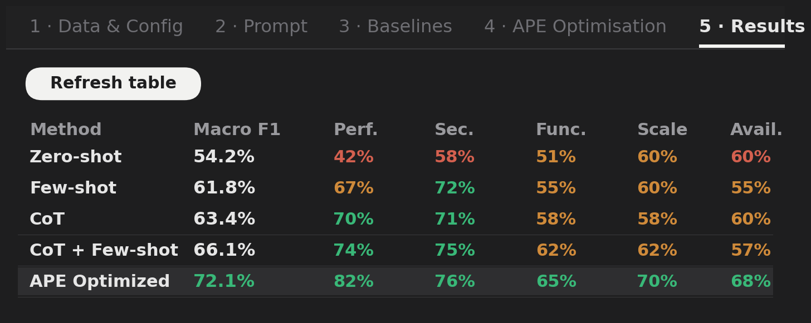

# APE Classification Tool

**Backtracking-enhanced Automatic Prompt Engineering (APE) for requirements classification.**

This repository is the replication package for *Automatic Prompt Engineering
(APE): the Case of Requirements Classification* (Zadenoori et al.). It provides
a tested implementation of the paper's **Algorithm 1**, the four
prompting baselines, the full statistical analyses for **RQ1-RQ4**, an
interactive GUI, and the class definitions and datasets used in the study.

Everything - CLI, Gradio app, and the paper experiments - shares one
implementation in [`ape/core`](ape/core).

---

## The interactive tool

The GUI operationalizes the full pipeline behind five tabs. It requires no
coding, infers the label set from the data, and runs against a local
open-weight model (via Ollama) or any OpenAI-compatible endpoint.

### 1 - Data & Config
Upload a CSV (text first, label last). The tool reports the class distribution
and exposes the run hyper-parameters - the **pool/val/test** split, majority
voting runs, the iteration budget `N_max`, and the backtracking threshold `X` -
as sliders.



### 2 - Prompt
The prompt is split into a **fixed part** (task framing, never changes) and an
**optimizable part** (the label definitions). APE rewrites only the latter,
focusing the search on the semantically meaningful portion of the prompt.



### 3 - Baselines
Run zero-shot, few-shot, Chain-of-Thought, and CoT + few-shot individually or
together, with per-class F1 for each - all scored on the held-out test set.



### 4 - APE Optimisation
The core of the tool, executing Algorithm 1 one interactive iteration at a time
or automatically to the budget. In-loop scoring uses the **validation** set;
the **test** set is evaluated once on the final prompt. The iteration log, the
colored history strip (green = improvement, amber = backtrack), the live best
prompt and its evolving optimizable section, and the current per-class metrics
are surfaced together, exposing the optimization trajectory.



### 5 - Results
Contrasts every method run in the session by macro- and per-class F1, making
the gain of the optimized prompt over the strongest baseline immediately
legible.



---

## Installation

```bash
git clone <this-repo>
cd ape-classification-tool
pip install -e ".[web,analysis,figures,dev]"
```

For local open-weight models, install [Ollama](https://ollama.com) and pull one
of the five models from the paper:

```bash
ollama pull llama3:8b-instruct       # or qwen2:7b-instruct, falcon3:7b-instruct,
                                     #    granite3.2:8b-instruct, ministral:8b-instruct
OLLAMA_ORIGINS="*" ollama serve      # CORS open so the web GUI can reach it
```

---

## Quickstart

### Web GUI (Gradio)

```bash
python -m web.app                 # open http://localhost:7860
python -m web.app -- --share      # shareable link
```

### Command line (reproduces the paper protocol)

```bash
python -m scripts.run_experiment \
    --dataset datasets/sample_security.csv \
    --definitions definitions/finegrained/security.txt \
    --backend ollama --model llama3:8b-instruct \
    --n-max 20 --backtrack 3 --voting 3 \
    --out results/security_llama3.json
```

This runs the four baselines and the APE optimizer on a single fixed
pool/val/test split, and writes per-class and macro-F1 for every method.

### Statistical analyses (RQ1-RQ4)

```bash
python -m scripts.run_stats
```

Reproduces the paper's statistics from the result tables (details below).

---

## The five language models

The paper evaluates five open-weight instruction-tuned models (served via
Ollama), registered in [`ape/backends/llm.py`](ape/backends/llm.py):

| Model | Params | Attention | Pretraining / Instruction | Organization |
|-------|:------:|-----------|---------------------------|--------------|
| Qwen2-7B       | 7B | RoPE + MQA              | Multilingual corpora, code, instruction tuning | Alibaba Cloud |
| Falcon3-7B     | 7B | MQA                     | English web text, instruction data             | TII (UAE) |
| Granite-3.2-8B | 8B | Scaled dot-product      | Business text, code, domain adaptation         | IBM Research |
| Ministral-8B   | 8B | Sliding Window Attention| Instruction datasets, reasoning tasks          | Mistral AI |
| LLaMA-3-8B     | 8B | GQA + RoPE              | Multilingual corpora, SFT tasks                | Meta AI |

---

## Algorithm 1 - implementation map

The optimizer in [`ape/core/optimizer.py`](ape/core/optimizer.py) follows the
pseudocode line by line.

| Algorithm step | Code |
|----------------|------|
| Phase 1 - three-way split (30/30/40) | `three_way_split()` in `core/data.py` |
| Phase 1 - initial 2 pos + 2 neg examples `E` | `initial_examples()` in `core/examples.py` |
| Phase 1 - score `p1` on `D_val`; init `p*`, `ptr`, ranked list `R` | `optimize()` Phase 1 block |
| Step 2.1 - generate candidate via APE from `p_curr` given `E` | `generate_candidate()` |
| Step 2.2 - evaluate on `D_val` (3-run majority voting) | `val_f1()` -> `classify()` + `compute_metrics()` |
| Step 2.3 - insert into ranked list `R`, kept sorted by F1 | `ranked.append(...); ranked.sort(...)` |
| Step 2.4 - compare to best; update `p*`, `c`, `ptr` | improvement branch |
| Step 2.5 - backtracking check (`c == X`) | backtrack branch using `ptr` |
| Step 2.6 - dynamic example selection (1 correct-pos / correct-neg / mis-pos / mis-neg) | `dynamic_examples()` |
| Phase 3 - single held-out evaluation on `D_test` | final `classify()` + `compute_metrics()` |

**Data-partitioning safeguard.** In-loop scoring, ranking, and backtracking
touch only `D_val`; `D_test` is evaluated exactly once on the final prompt `p*`.
Baselines are scored on the same `D_test`, drawing demonstrations from `D_pool`,
so no method enjoys an information advantage.

---

## Class definitions (APE-Informed vs APE-Uninformed)

`definitions/` provides ready-to-use *optimizable prompts* at two granularities,
corresponding to the paper's two initialization strategies:

| Task | Simple (Uninformed) | Fine-grained (Informed) |
|------|--------|--------------|
| Security vs. Non-security        | `simple/security.txt`   | `finegrained/security.txt` |
| Functional vs. Non-functional    | `simple/functional.txt` | `finegrained/functional.txt` |
| Quality vs. Non-quality          | `simple/quality.txt`    | `finegrained/quality.txt` |

The fine-grained definitions are grounded in the requirements-engineering
literature (Haley/Nuseibeh et al.; ISO/IEC/IEEE 29148; Firesmith; Glinz;
ISO/IEC 25010-derived quality models). See [`definitions/README.md`](definitions/README.md).

---

## Datasets

The paper uses three public benchmarks (download links in
[`datasets/README.md`](datasets/README.md)):

| Dataset | # Reqs. | Task |
|---------|:-------:|------|
| PROMISE (NFR)     | 625 | Functional vs. Non-functional |
| PROMISE (Refined) | 625 | Functional / Quality (and only-F / only-Q) |
| SecReq            | 510 | Security vs. Non-security |

Small runnable **sample** CSVs (`datasets/sample_*.csv`) ship with the repo so
the tool works out of the box; replace them with the full benchmarks to
reproduce the paper.

---

## Statistical analyses

`analysis/stats.py` implements all four RQ analyses; `scripts/run_stats.py` runs
them on the transcribed result tables in `analysis/results/`.

- **RQ1** - APE vs each baseline: Wilcoxon signed-rank (one-tailed),
  Holm-Bonferroni correction, effect size r = Z/sqrt(N). *Result:* APE beats all
  four baselines with large effect sizes (Table 6: improvements of about
  +0.14 / +0.11 / +0.12 / +0.11, all significant).
- **RQ2** - dataset vs LLM effect: Friedman test + Kendall's W. *Result:*
  dataset effect significant (chi2(2)=10.0, p=0.007, W=1.00); LLM effect not
  significant (chi2(4)=2.92, p=0.572, W=0.24) - reproduced exactly.
- **RQ3** - prompt-feature regression of wF1 (standardized beta, R^2). Supply a
  per-iteration feature log via `--rq3 PATH`; a synthetic demo runs otherwise.
- **RQ4** - APE-Informed vs APE-Uninformed: Wilcoxon on final wF1 (delta=+0.015,
  n.s.) and on gain-over-baseline (delta=+0.033, n.s.) - informed initialization
  is not significantly better, matching the paper.

See [`analysis/README.md`](analysis/README.md) for data provenance and a note on
the RQ1 average-F1 vs weighted-F1 distinction.

---

## Repository layout

```
ape/
  core/            # algorithm, metrics, prompting, splitting (shared by all front-ends)
    optimizer.py   #   Algorithm 1
    baselines.py   #   the four prompting strategies
    examples.py    #   initial + dynamic example selection
    prompting.py   #   prompt assembly, label extraction, voted classification
    metrics.py     #   per-class / macro F1, majority voting
    data.py        #   Example, Split, three-way splitter
  backends/        # Ollama and OpenAI-compatible backends + the 5 paper models
analysis/
  stats.py         # RQ1-RQ4 statistical tests
  results/         # per-cell F1 and wF1 tables transcribed from the paper
definitions/       # simple/ and finegrained/ label definitions
datasets/          # sample CSVs + links to the full benchmarks
scripts/
  run_experiment.py  # CLI runner (paper protocol)
  run_stats.py       # RQ1-RQ4 analyses
  render_figures.py  # regenerate the GUI figures (vector PDFs)
web/
  app.py             # Gradio GUI
  ape_tool.jsx       # standalone React tool
figures/           # rendered GUI panels (PDF + PNG, shown above)
tests/             # deterministic end-to-end tests (no network)
docs/              # paper subsection (.tex) and setup notes
```

---

## Tests

```bash
python -m tests.test_optimizer      # or: pytest -q
```

Deterministic mock backend (no network) verifies the split is disjoint, the
ranked list stays sorted, dynamic selection returns four balanced examples,
backtracking fires, and the final test evaluation runs once.

---

## Citing

Please cite the accompanying paper (see `docs/`). Replace the placeholder
repository URL in `docs/tool_subsection.tex` with this repo's final URL.

## License

MIT - see [LICENSE](LICENSE).
